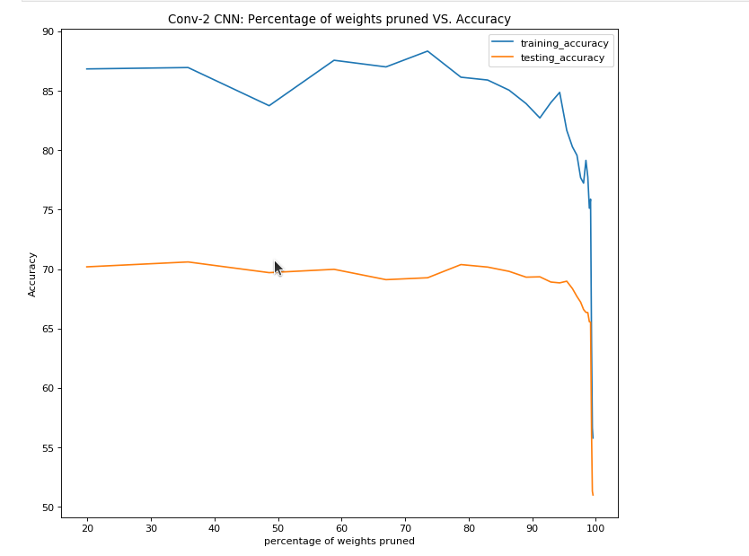
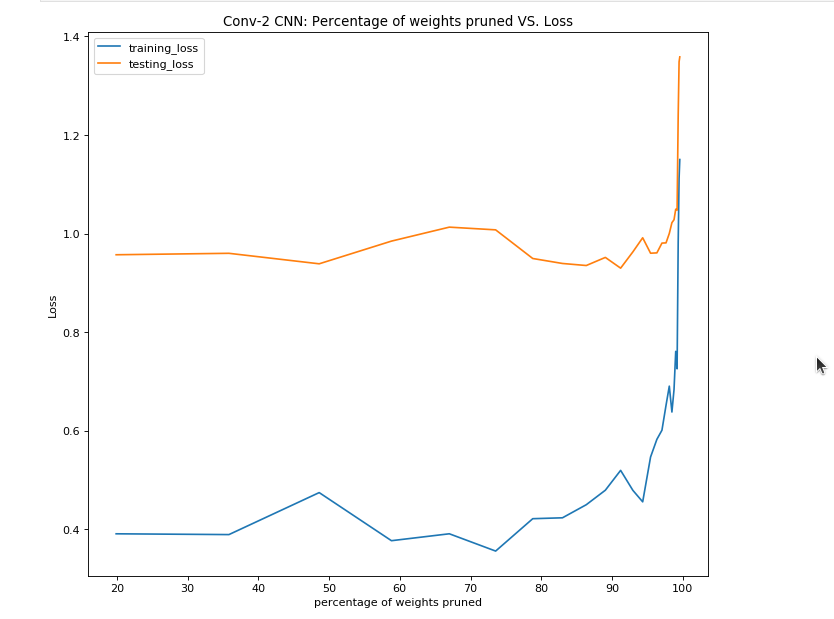
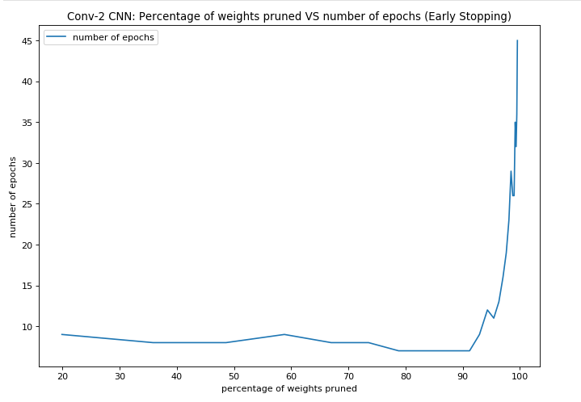
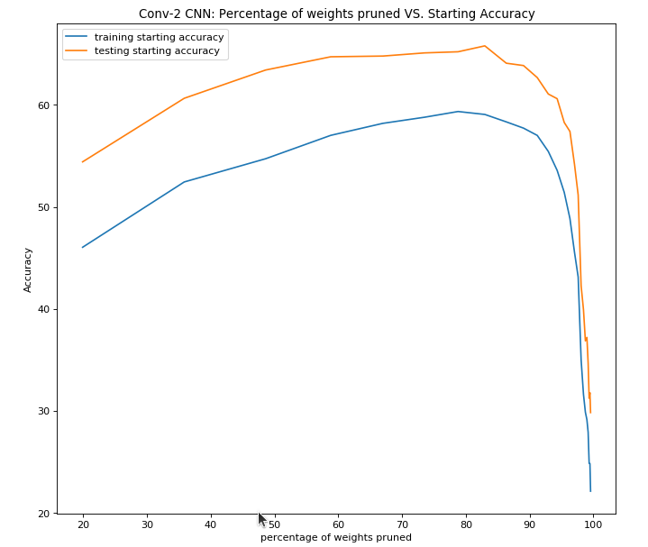
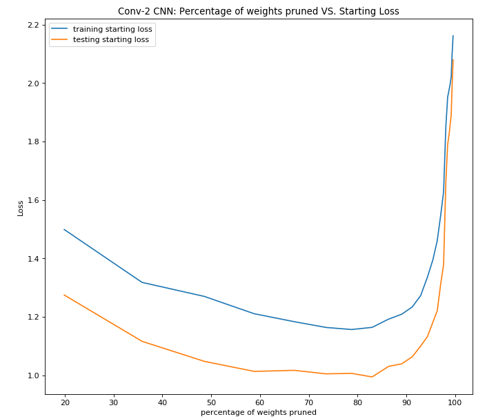
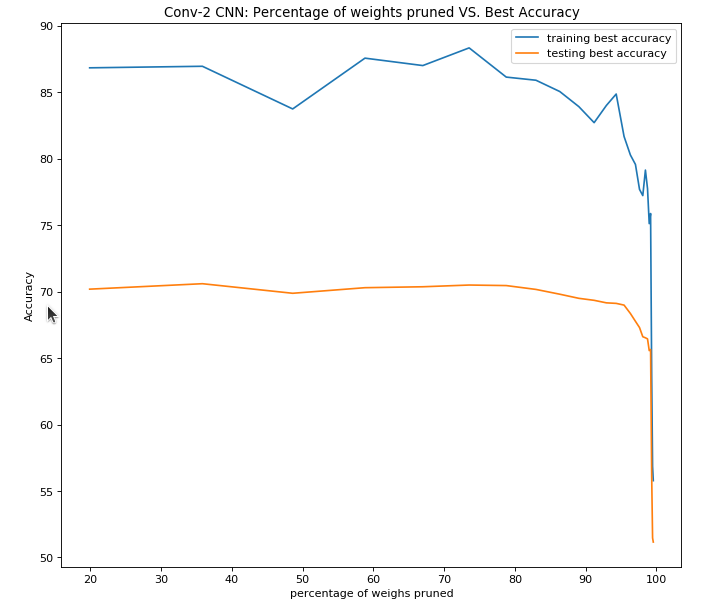
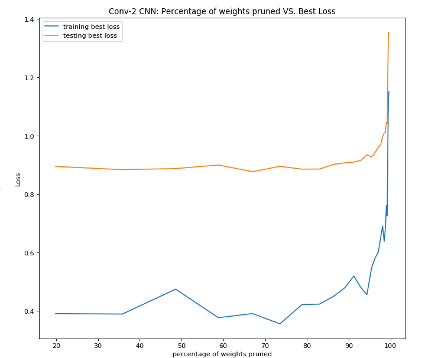
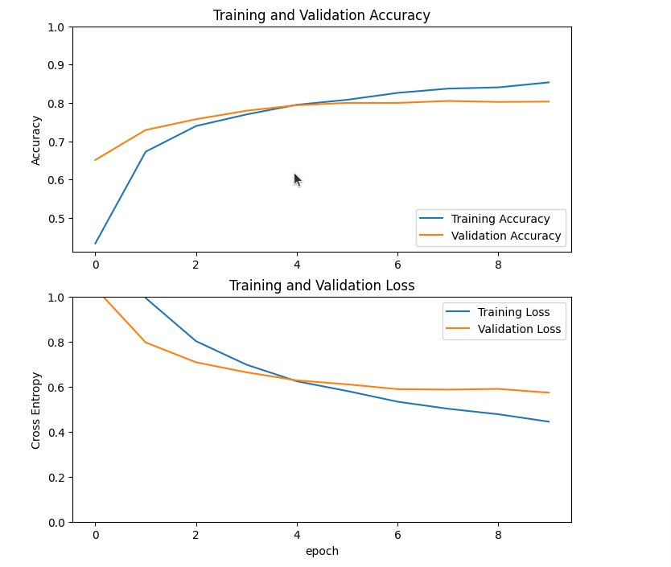

# Progress Update 
Last Update: Oct 18, 2023

**Aim:** to perform pruning experiments for the task of Image Classification
**Dataset:** Incidents Dataset
**Base models:** MobileNet / ResNet-50
**Pruning Technique:** Lottery Ticket Hypothesis

**Goal:** to to replicate Lottery Ticket Hypothesis (LTH) and produce pruning graphs like below as demonstrated in the project https://github.com/arjun-majumdar/Lottery_Ticket_Hypothesis-TensorFlow_2 notebook https://github.com/arjun-majumdar/Lottery_Ticket_Hypothesis-TensorFlow_2/blob/master/Conv_2_LTH_CIFAR10.ipynb

Current progress: atttempt to replicate LTH tensorflow experiment with different base model and dataset

